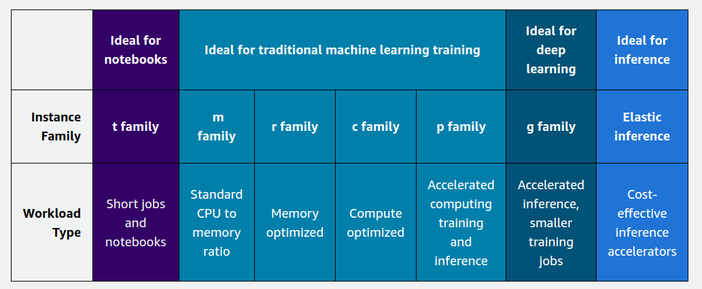
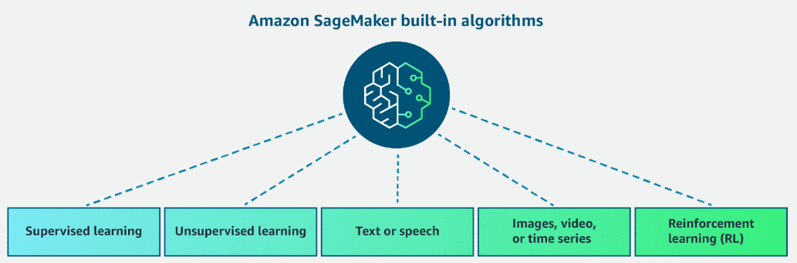
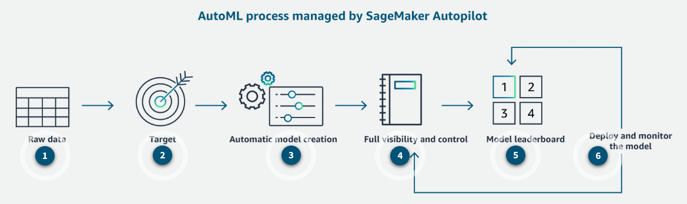

# Study Notes

## IAM

IAM roles provide permissions to AWS services or users to access AWS resources securely. These roles are used to delegate access within an AWS account or across different AWS accounts. When assuming an IAM role, a user or service temporarily takes on the permissions and policies that are associated with that role. This action gives the user or service the ability to perform actions on AWS resources that are based on the permissions that are granted by the role without the need to use long-term credentials, such as access keys.

To provide access to a user in one AWS account (the ML startup's account) to resources in another AWS account (the company's account), you must create an IAM role in the company's account with the necessary permissions and trust relationship and then specify the ML startup account's ID. The user in the client account can then assume the role and obtain temporary credentials for secure cross-account access. Configuring cross-account IAM roles is the only way to provide both programmatic and console access to S3 buckets across accounts. In this scenario, the role that is created in the company's account is then assumed by the ML startup's users to access the S3 bucket.

## S3

You can use Amazon S3 Event Notifications to receive notifications when predefined events occur in an S3 bucket. You can use event notifications to invoke an event. In this scenario, you can use the event to run a step function as the destination.

- https://docs.aws.amazon.com/AmazonS3/latest/userguide/EventNotifications.html

## Step Functions

Step Functions is a serverless orchestration service that you can use to coordinate and sequence multiple AWS services into serverless workflows.

- https://docs.aws.amazon.com/step-functions/latest/dg/welcome.html

## SageMaker

### Instance Types

- General Purpose
  - These instances are suitable for a variety of ML tasks, including training and inference.
  - Examples include the ml.m5 and ml.c5 instance families.
  - They offer a balance of compute power, memory, and networking capabilities, which makes them suitable for most ML workloads.

- Compute Optimized
  - These instances are designed for compute-intensive workloads, such as training deep learning models or performing large-scale data processing.
  - Examples include the ml.p3 and ml.c5n instance families, which are powered by high-performance GPUs and CPUs, respectively.
  - They are well-suited for training complex neural networks, computer vision tasks, natural language processing, and other compute-intensive ML workloads.
  
- Memory Optimized
  - These instances are optimized for workloads that require a large amount of memory, such as processing large datasets or running memory-intensive algorithms.
  - Examples include the ml.r5 and ml.r5n instance families.
  - They are particularly useful for tasks like large-scale data processing, in-memory databases, and certain types of deep learning models with large memory requirements.

- Accelerated Computing
  - These instances are designed specifically for accelerating compute-intensive workloads using hardware accelerators like GPUs or Tensor Cores.
  - Examples include the ml.g4dn and ml.inf1 instance families, which are powered by NVIDIA GPUs and AWS Inferentia chips, respectively.
  - They are ideal for tasks like training and deploying deep learning models and performing real-time inference at scale.
  
- Inference
  - These instances are optimized for low-latency, high-throughput inference workloads, which are common in production deployments of ML models.
  - Examples include the ml.inf1 and ml.c6i instance families.
  - They are designed to provide cost-effective and efficient inference capabilities, which makes them suitable for deploying ML models in real-time applications.

When selecting a SageMaker instance type, you should consider several factors, such as the following.

* Workload requirements  
    Evaluate the computational demands of your ML task. This includes the complexity of the model, the size of the dataset, and the desired training or inference performance. 

* Performance  
    Different instance types offer varying levels of performance in terms of CPU, GPU, memory, and networking capabilities. Choose an instance type that aligns with your performance requirements.

* Cost  
    SageMaker instances are billed on an hourly basis, and different instance types have varying costs. Consider your budget constraints and choose an instance type that provides the best performance-to-cost ratio for your needs.

* Availability  
    Some instance types might have limited availability in certain AWS Regions. Ensure that the instance type you need is available in your preferred Region.

* Scalability  
    If you anticipate your workload requirements will change over time, consider instance types that offer scalability options. Instances should be able to scale up or down resources or use automatic scaling features.

* Integration with other AWS services  
    Consider whether your ML workflow involves other AWS services and choose an instance type that integrates well with those services. By carefully evaluating these factors, you can select the most suitable SageMaker instance type for your specific ML workload. These factors help to ensure optimal performance, cost-effectiveness, and scalability.

### Model Selection

When selecting a model in SageMaker, consider the following factors.

* Problem type  
    The first step is to identify the type of problem you're trying to solve, such as classification, regression, clustering, or recommendation systems. Some algorithms are better suited for specific problem types.

* Data characteristics  
    Analyze your data to understand its size, dimensionality, noise levels, and potential biases. This information can guide you in choosing an appropriate model architecture and algorithm.

* Performance requirements  
    Consider the desired performance metrics for your model, such as accuracy, precision, recall, or F1-score. Some algorithms might prioritize one metric over others, so choose accordingly. 

* Training time and computational resources  
    Models have varying computational requirements during training. Consider the available resources (CPU, GPU, and memory) and the time constraints for your project.

* Interpretability  
    If interpretability is important for your use case, you might want to choose simpler models like linear or tree-based algorithms over complex deep learning models. The latter can be more challenging to interpret.

* Model complexity  
    Simple models might not capture complex patterns in the data, whereas overly complex models can lead to overfitting. Strike a balance between model complexity and generalization performance.

* Scalability  
    If your dataset or application is expected to grow significantly, choose a model that can scale well with increasing data volume and complexity.

* Domain knowledge  
    Use your domain expertise or consult with subject matter experts to inform your model selection process. Take into consideration that certain algorithms might be more suitable for specific domains.

### Model Types

* Generalized linear models  
    These models include linear regression, logistic regression, and linear support vector machines. They are fast to train and interpret but have low flexibility.

* Tree-based models  
    These models include boosted trees, random forests, and decision trees. They provide higher accuracy than linear models with slightly longer training times. They are more flexible and interpretable than neural networks.Tree-based models

* Neural-networks  
    These include multilayer perceptrons and convolutional neural networks. They require large datasets but can model complex nonlinear relationships. They are slow to train and difficult to interpret.

* Clustering  
    This option includes algorithms like k-means and DBSCAN for segmenting data into groups with high intra-group and low inter-group similarity. It is useful for exploratory data analysis.

* Matrix factorization  
    This option includes techniques like principal components analysis for recommender systems, dimensionality reduction, and feature learning.

* Forecasting  
    This option includes time series models like autoregressive integrated moving average (ARIMA) for forecasting future values based on past data.

* Computer vision  
    This option includes pre-built models for object detection and semantic segmentation in images and videos using neural networks.

### Built-in Algorithms

  
For more information, visit [Use Amazon SageMaker Built-in Algorithms or Pre-trained Models](https://docs.aws.amazon.com/sagemaker/latest/dg/algos.html).

* Supervised Learning
  
  * Linear Learner Algorithm  
    Learns a linear function for regression or a linear threshold function for classification.  
    To learn more, see: [Linear Learner Algorithm](https://docs.aws.amazon.com/sagemaker/latest/dg/linear-learner.html).

  * XGBoost Algorithm  
    Implements a gradient-boosted trees algorithm that combines an ensemble of estimates from a set of simpler and weaker models.  
    To learn more, see: [XGBoost Algorithm](https://docs.aws.amazon.com/sagemaker/latest/dg/xgboost.html).

  * K-Nearest Neighbors (k-NN) Algorithm  
    Uses a non-parametric method that uses the k nearest labeled points to assign a label to a new data point for classification— can also be used to predict a target value from the average of the k nearest points for regression.  
    To learn more, see: [K-Nearest Neighbors (k-NN) Algorithm](https://docs.aws.amazon.com/sagemaker/latest/dg/k-nearest-neighbors.html).

  * Factorization Machines Algorithm  
    An extension of a linear model that is designed to economically capture interactions between features within high-dimensional sparse datasets.  
    To learn more, see: [Factorization Machines Algorithm](https://docs.aws.amazon.com/sagemaker/latest/dg/fact-machines.html).

* Unsupervised Learning

  * K-Means Algorithm  
    This algorithm finds discrete groupings within data. It first looks to see if all the data points in a cluster are as similar to each other as possible. It then looks to see if data points from different clusters are as different as possible.  
    Uses: Clustering  
    To learn more, see [K-Means Algorithm](https://docs.aws.amazon.com/sagemaker/latest/dg/k-means.html).

  * Latent Dirichlet Allocation (LDA) Algorithm  
    This algorithm determines an algorithm suitable for determining topics in a set of documents. It is an unsupervised algorithm, which means that it doesn't use example data with answers during training.  
    Uses: Clustering and Topic Modeling  
    To learn more, see [Latent Dirichlet Allocation (LDA) Algorithm](https://docs.aws.amazon.com/sagemaker/latest/dg/lda.html).

  * Object2Vec Algorithm  
    This algorithm uses a new highly customizable, multi-purpose algorithm for feature engineering. It can learn low-dimensional dense embeddings of high-dimensional objects to produce features that improve training efficiencies for downstream models. This is a supervised algorithm because it requires labeled data for training. There are many scenarios in which the relationship labels can be obtained purely from natural clusterings in data without any explicit human annotation.  
    Uses: Embeddings  
    To learn more, see [Object2Vec Algorithm](https://docs.aws.amazon.com/sagemaker/latest/dg/object2vec.html).  

  * Random Cut Forest (RCF) Algorithm  
    This algorithm detects anomalous data points within a dataset that diverge from otherwise well-structured or patterned data.  
    Uses: Anomaly Detection  
    To learn more, see [Random Cut Forest (RCF) Algorithm](https://docs.aws.amazon.com/sagemaker/latest/dg/randomcutforest.html).

  * IP Insights  
    This algorithm learns the usage patterns for IPv4 addresses. It is designed to capture associations between IPv4 addresses and various entities, such as user IDs or account numbers.  
    Uses: Anomaly Detection  
    To learn more, see [IP Insights](https://docs.aws.amazon.com/sagemaker/latest/dg/ip-insights.html).

  * Principal Component Analysis (PCA) Algorithm  
    This algorithm reduces the dimensionality, or number of features, within a dataset by projecting data points onto the first few principal components. The objective is to retain as much information or variation as possible. For mathematicians, principal components are eigenvectors of the data's covariance matrix.  
    Uses: Dimensionality Reduction  
    To learn more, see [Principal Component Analysis (PCA) Algorithm](https://docs.aws.amazon.com/sagemaker/latest/dg/pca.html).

* Text or Speech data

  * BlazingText Algorithm  
    This highly optimized implementation of the Word2vec and text classification algorithms scales to large datasets. It is useful for many downstream natural language processing (NLP) tasks.  
    Uses: Text classification, Word2Vec  
    To learn more, see [BlazingText Algorithm](https://docs.aws.amazon.com/sagemaker/latest/dg/blazingtext.html).

  * Sequence-to-Sequence Algorithm  
    This supervised algorithm is commonly used for neural machine translation.  
    Uses: Machine Translation for text or speech  
    To learn more, see [Sequence-to-Sequence Algorithm](https://docs.aws.amazon.com/sagemaker/latest/dg/seq-2-seq.html).

  * Neural Topic Model (NTM) Algorithm  
    This is another unsupervised technique for determining topics in a set of documents. It uses a neural network approach.  
    Uses: Topic modeling  
    To learn more, see: [Neural Topic Model (NTM) Algorithm](https://docs.aws.amazon.com/sagemaker/latest/dg/ntm.html).

* Images, videos or time-series

  * ResNet  
    This is a deep learning network developed to be highly accurate for image classification.  
    Uses: Image classification  
    To learn more, see [ResNet](https://arxiv.org/abs/1512.03385).

  * Single Shot multibox Detector (SSD)  
    This uses a convolutional neural network (CNN) pretrained for classification tasks as the base network. When using this for object detection, SageMaker supports various CNNs such as VGG-16 and ResNet-50.  
    Uses: Object detection  
    To learn more, see: [Single Shot multibox Detector (SSD)](https://arxiv.org/pdf/1512.02325.pdf).  
    For more information about supported CNNs, see [VGG-16](https://arxiv.org/pdf/1409.1556.pdf) and [ResNet-50](https://arxiv.org/pdf/1603.05027.pdf).

  * Semantic Segmentation Algorithm  
    The SageMaker semantic segmentation algorithm provides a fine-grained, pixel-level approach to developing computer vision applications. It tags every pixel in an image with a class label from a predefined set of classes. Tagging is fundamental for understanding scenes. This is critical to an increasing number of computer vision applications, such as self-driving vehicles, medical imaging diagnostics, and robot sensing. The SageMaker semantic segmentation algorithm is built using the MXNet Gluon Framework and the Gluon CV Toolkit. It provides you with a choice of three built-in algorithms to train a deep neural network. You can use the Fully-Convolutional Network (FCN) Algorithm, Pyramid Scene Parsing (PSP) Algorithm, or DeepLabV3.  
    Uses: Semantic Segmentation  
    To learn more, see: [Semantic Segmentation Algorithm](https://docs.aws.amazon.com/sagemaker/latest/dg/semantic-segmentation.html).  
    For more information on the framework of this algorithm, see [MXNet Gluon Framework and the Gluon CV Toolkit](https://github.com/dmlc/gluon-cv).  
    For more information on built-in algorithms, see [Fully-Convolutional Network (FCN) Algorithm](https://arxiv.org/abs/1605.06211), [Pyramid Scene Parsing (PSP) Algorithm](https://arxiv.org/abs/1612.01105), or [DeepLabV3](https://arxiv.org/abs/1706.05587).

  * DeepAR Forecasting Algorithm  
    This supervised learning algorithm is for forecasting scalar (one-dimensional) time series using recurrent neural networks (RNN).  
    Uses: Time-series  
    To learn more, see: [DeepAR Forecasting Algorithm](https://docs.aws.amazon.com/sagemaker/latest/dg/deepar.html)

* Reinforcement Learning

    For more information, see [Use Reinforcement Learning with Amazon SageMaker](https://docs.aws.amazon.com/sagemaker/latest/dg/reinforcement-learning.html).

### Autopilot (AutoML)

Autopilot is a part of SageMaker Canvas. SageMaker Autopilot performs the following key tasks that you can use on autopilot or with various degrees of human guidance.

* Data analysis and processing  
    SageMaker Autopilot identifies your specific problem type, handles missing values, normalizes your data, selects features, and prepares the data for model training.

* Model selection  
    SageMaker Autopilot explores a variety of algorithms. SageMaker Autopilot uses a cross-validation resampling technique to generate metrics that evaluate the predictive quality of the algorithms based on predefined objective metrics.

* Hyperparameter optimization  
    SageMaker Autopilot automates the search for optimal hyperparameter configurations.

* Model training and evaluation  
    SageMaker Autopilot automates the process of training and evaluating various model candidates. It splits the data into training and validation sets, and then it trains the selected model candidates using the training data. Then it evaluates their performance on the unseen data of the validation set. Lastly, it ranks the optimized model candidates based on their performance and identifies the best performing model.

* Model deployment  
    After SageMaker Autopilot has identified the best performing model, it provides the option to deploy the model. It accomplishes this by automatically generating the model artifacts and the endpoint that expose an API. External applications can send data to the endpoint and receive the corresponding predictions or inferences.

1. Raw data: Load tabular data from Amazon S3 to train the model.
2. Target: Select the target column for prediction.
3. Automatic model creation: The correct algorithm is chosen, training and tuning is done automatically for the right model.
4. Full visibility and control: Full visibility with model notebooks.
5. Model leaderboard: Select the best model for your needs from a ranked list of recommendations.
6. Deploy and monitor the model: Choice to optimize and retrain, to improve the model.

To learn more about this feature set see, [SageMaker AutoPilot](https://docs.aws.amazon.com/sagemaker/latest/dg/autopilot-automate-model-development.html).

### VPC

- https://docs.aws.amazon.com/sagemaker/latest/dg/interface-vpc-endpoint.html
- https://docs.aws.amazon.com/sagemaker/latest/dg/mkt-algo-model-internet-free.html

- Option: Configure SageMaker in VPC only mode. Configure security groups to block internet access.
  You can use a VPC to launch AWS resources within your own isolated virtual network. Security groups are a security control that you can use to control access to your AWS resources. You can protect your data and resources by managing security groups and restricting internet access from your VPC. However, this solution requires additional network configuration and therefore increases operational overhead.  
  Learn more about [SageMaker in VPC only mode](https://docs.aws.amazon.com/sagemaker/latest/dg/onboard-vpc.html).

### Deployment

You can use a SageMaker asynchronous endpoint to host an ML model. With a SageMaker asynchronous endpoint, you can receive responses for each request in near real time for up to 60 minutes of processing time. There is no idle cost to operate an asynchronous endpoint. Therefore, this solution is the most cost-effective. Additionally, you can configure a SageMaker asynchronous inference endpoint with a connection to your VPC.

- https://docs.aws.amazon.com/sagemaker/latest/dg/deploy-model.html#deploy-model-options
- https://docs.aws.amazon.com/sagemaker/latest/dg/async-inference.html

During an in-place deployment, you update the application by using existing compute resources. You stop the current version of the application. Then, you install and start the new version of the application. In-place deployment does not meet the requirement to minimize the risk of downtime because this strategy relies on downtime to make the shift. Additionally, this strategy does not meet the requirement to gradually shift traffic from the old model to the new model.  
Learn more about [in-place deployment](https://docs.aws.amazon.com/whitepapers/latest/introduction-devops-aws/in-place-deployments.html).

SageMaker is a fully managed service for the end-to-end process of building, serving, and monitoring ML models. You can create a SageMaker model resource from an existing model that you built on your own. Then, you can deploy that model to a SageMaker endpoint. Serverless SageMaker endpoints are the most suitable for this scenario and provide the least effort. Serverless SageMaker endpoints scale independently in a fully serverless manner. Additionally, the memory requirements fit within the 6 GB memory and 200 maximum concurrency limits of serverless endpoints.  
Learn more about [SageMaker endpoints](https://docs.aws.amazon.com/sagemaker/latest/dg/whatis.html).  
Learn more about [SageMaker endpoint types](https://docs.aws.amazon.com/sagemaker/latest/dg/how-it-works-deployment.html).  
Learn more about [serverless inference](https://docs.aws.amazon.com/sagemaker/latest/dg/serverless-endpoints.html).

### Containers

You can use the SageMaker SDK to bring existing ML models that are written in R into SageMaker by using the "bring your own container" option. This solution requires the least operational overhead because you only need to compose a Dockerfile for each existing model.  
Learn more about [how to bring your own containers in SageMaker](https://docs.aws.amazon.com/sagemaker/latest/dg/model-monitor-byoc-containers.html).  
Learn more about [how to use R in SageMaker](https://docs.aws.amazon.com/sagemaker/latest/dg/r-guide.html).  

### Endpoints

SageMaker endpoints support a one-time or recurring scheduled scaling action to change the minimum and maximum capacity of the SageMaker endpoint. SageMaker also supports target tracking scaling policies to dynamically increase or decrease capacity based on a target value for a performance metric. You can schedule a capacity increase to provision additional endpoint resources before each promotional event, while a target tracking scaling policy is still in effect. This combination of scaling policies provides a consistent experience to the many users that join as the events begin. The target tracking scaling policy will continue to dynamically scale capacity during the event relative to the new minimum and maximum capacity levels.  
Learn more about [how to use scheduled scaling policies for SageMaker endpoints](https://docs.aws.amazon.com/sagemaker/latest/dg/endpoint-auto-scaling-prerequisites.html#scheduled-scaling).  
Learn more about [how to use target tracking scaling policies for SageMaker endpoints](https://docs.aws.amazon.com/sagemaker/latest/dg/endpoint-auto-scaling-prerequisites.html#endpoint-auto-scaling-policy).

### Input Modes

Input modes include file mode, pipe mode, and fast file mode. File mode downloads training data to a local directory in a Docker container. Pipe mode streams data directly to the training algorithm. Therefore, pipe mode can lead to better performance. Fast file mode provides the benefits of both file mode and pipe mode. For example, fast file mode gives SageMaker the flexibility to access entire files in the same way as file mode. Additionally, fast file mode provides the better performance of pipe mode.

Before you begin training, fast file mode identifies S3 data source files. However, fast file mode does not download the files. Instead, fast file mode gives the model the ability to begin training before the entire dataset has finished loading. Therefore, fast file mode decreases the startup time. As the training progresses, the entire dataset will load. Therefore, you must have enough space within the storage capacity of the training instance. This solution provides an update to only a single parameter and does not require any code changes. Therefore, this solution requires the least operational overhead.

Learn more about [how to access training data](https://docs.aws.amazon.com/sagemaker/latest/dg/model-access-training-data.html).

### AMT

SageMaker AMT searches for the most suitable version of a model by running training jobs based on the algorithm and objective criteria. You can use a warm start tuning job to use the results from previous training jobs as a starting point. You can set the early stopping parameter to Auto to enable early stopping. SageMaker can use early stopping to compare the current objective metric (accuracy) against the median of the running average of the objective metric. Then, early stopping can determine whether or not to stop the current training job. The TRANSFER_LEARNING setting can use different input data, hyperparameter ranges, and other hyperparameter tuning job parameters than the parent tuning jobs.

### Model Registry

You can use SageMaker Model Registry to create a catalog of models for production, to manage the versions of a model, and to associate metadata to the model. Additionally, SageMaker Model Registry can manage approvals and automate model deployment for continuous integration and continuous delivery (CI/CD). You would not use SageMaker Model Registry for model re-training.

- https://docs.aws.amazon.com/sagemaker/latest/dg/model-registry.html

### Experiments

SageMaker Experiments is a feature of SageMaker Studio that you can use to automatically create ML experiments by using different combinations of data, algorithms, and parameters. You would not use SageMaker Experiments to collect new data for model re-training.

- https://docs.aws.amazon.com/sagemaker/latest/dg/experiments.html

### Model Monitor

You can use SageMaker Model Monitor to effectively gauge model quality. Data Capture is a feature of SageMaker endpoints. You can use Data Capture to record data that you can then use for training, debugging, and monitoring. Then, you could use the new data that is captured by Data Capture to re-train the model. Data Capture runs asynchronously without impacting production traffic.

- https://docs.aws.amazon.com/sagemaker/latest/dg/model-monitor.html
- https://docs.aws.amazon.com/sagemaker/latest/dg/model-monitor-faqs.html
- https://docs.aws.amazon.com/sagemaker/latest/dg/model-monitor-data-capture.html

You can use the ModelExplainabilityMonitor class to generate a feature attribution baseline and to deploy a monitoring mechanism that evaluates whether the feature attribution has occurred. You can use CloudWatch to send notifications when feature attribution drift has occurred.

Learn more about [how to monitor for feature attribution drift](https://docs.aws.amazon.com/sagemaker/latest/dg/clarify-model-monitor-feature-attribution-drift.html).

Learn more about [the ModelExplainabilityMonitor class](https://docs.aws.amazon.com/sagemaker/latest/dg/clarify-model-monitor-shap-baseline.html).

Learn more about [CloudWatch integration with SageMaker Model Monitor](https://docs.aws.amazon.com/sagemaker/latest/dg/model-monitor.html).

### Pipelines

SageMaker Pipelines is a workflow orchestration service within SageMaker. SageMaker Pipelines supports the use of batch transforms to run inference of entire datasets. Batch transforms are the most cost-effective inference method for models that are called only on a periodic basis. Real-time inference would create instances that the company would not use for most of the week.

After you create the inference pipeline, EventBridge can automate the execution of the pipeline. You would need to create a role to allow EventBridge to start the execution of the pipeline that was created in the previous step. You can use a scheduled run to execute the inference pipeline at the beginning of every week. You do not have a specific pattern that you need to match to invoke the execution. Therefore, you do not need to create a custom event pattern.

- https://docs.aws.amazon.com/sagemaker/latest/dg/inference-pipeline-batch.html
- https://docs.aws.amazon.com/sagemaker/latest/dg/pipeline-eventbridge.html

### Jobs

You can use SageMaker processing jobs for data processing, analysis, and ML model training. You can use SageMaker processing jobs to perform transformations on images by using a script in multiple programming languages. In this scenario, you can run the custom code on data that is uploaded to Amazon S3. SageMaker processing jobs provide ready-to-use Docker images for popular ML frameworks and tools. Additionally, SageMaker offers built-in support for various frameworks including TensorFlow, PyTorch, scikit-learn, XGBoost, and more.

- https://docs.aws.amazon.com/sagemaker/latest/dg/processing-job.html

### TensorBoard

SageMaker with TensorBoard is a capability of SageMaker that you can use to visualize and analyze intermediate tensors during model training. SageMaker with TensorBoard provides full visibility into the model training process, including debugging and model optimization. This solution gives you the ability to debug issues, including lower than expected precision for a specific class. You can analyze the intermediate activations and gradients during training. Then, you can gain insights into why some mobile phone images were getting misclassified. Finally, you can make adjustments to improve model performance.

- https://docs.aws.amazon.com/sagemaker/latest/dg/tensorboard-on-sagemaker.html

## Bedrock

- To enhance a user question, you can add relevant retrieved documents into the context. You can use prompt engineering techniques to help support effective communication with the LLMs. By augmenting the prompt, the LLMs are able to generate precise answers to user queries.

Learn more about [augmenting the LLM prompt](https://aws.amazon.com/what-is/retrieval-augmented-generation/).

- You can use PDPs and Shapley values for model interpretability in ML. Shapley values focus on feature attribution. PDPs illustrate how the predicted target response changes as a function of one particular input feature of interest. DPL is a metric that you can use to detect pre-training bias. You can use DPL to avoid ML models that could potentially be biased or discriminatory.

Learn more about [Shapley values](https://docs.aws.amazon.com/sagemaker/latest/dg/clarify-shapley-values.html).

Learn more about [PDPs](https://docs.aws.amazon.com/sagemaker/latest/dg/clarify-processing-job-analysis-results.html#clarify-processing-job-analysis-results-pdp).

Learn more about [DPL](https://docs.aws.amazon.com/sagemaker/latest/dg/clarify-data-bias-metric-true-label-imbalance.html).

## Amazon Comprehend

Amazon Comprehend can be used to detect and redact personal information from user interactions. Amazon Comprehend provides the ability to locate and redact PII entities in English or Spanish text documents. By leveraging Amazon Comprehend, you can easily process and anonymize personal information in the customer data platform.

- https://docs.aws.amazon.com/comprehend/latest/dg/how-pii.html

## Responsible AI

- [Responsible AI](https://aws.amazon.com/ai/responsible-ai/)
- [Tools and resources to build AI responsibly](https://aws.amazon.com/ai/responsible-ai/resources/)